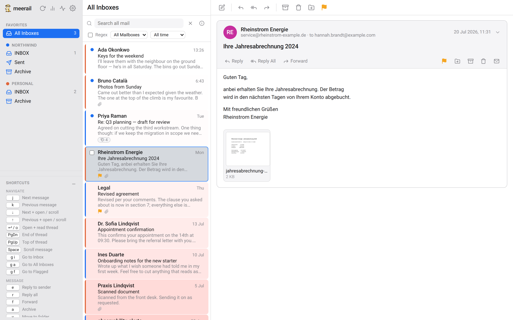

<p align="center">
  
</p>

<h1 align="center">meerail</h1>

<p align="center">The meerkat email program — an email client for power users</p>

---

meerail is a fast, self-hosted email client built for all IMAP and SMTP gateways (including the Proton Mail Bridge),
with **regex search over your whole mailbox** (attachment text included), conversation
**threading**, two-way sync, compose/reply/forward, and everything stored in **PostgreSQL**
for analytics. Runs on Linux, macOS and Windows.

**Features:** three-pane Apple-Mail-style UI · unified inbox across accounts · conversation
threading · POSIX-regex & keyword search (scope + "last N years" window, `:unread` / `:read` /
`:has-attachment` / `:from` / `:to` filters, searches PDF/Office attachment text via Tika) ·
sandboxed HTML rendering with remote-image blocking · read/flag/
archive/delete and compose that **sync back to your mail server** over IMAP/SMTP · file a mail
as a **Meerato task**, attachments and all · light + dark.

<p align="center">
  
</p>

It splits into three pieces:

- **`meerail-agent`** — runs on the machine with Proton Bridge and owns the whole write path:
  it speaks IMAP/SMTP to Bridge, parses and threads your mail, extracts attachment text via
  Tika, and writes it into Postgres. Your Bridge credentials never leave the host.
- **`meerail-server`** — the web layer in Docker: FastAPI + the Apple-Mail-style UI. It only
  reads from the database and enqueues your actions; it never fetches or parses mail.
- **`core`** — the shared library both import: models, parsing, threading, ingest, Tika.

## Background

meerail started from two things web mail cannot do: search your mail the way you search
code, and keep it somewhere you can query.

**Regex, not "search".** Every mail client offers substring matching over headers and, if
you are lucky, bodies. meerail pushes POSIX regular expressions straight down into
Postgres, over a corpus that already includes the extracted text of your PDF and Office
attachments — so `invoice.*2024` finds the invoice inside the attachment, not just mails
that happen to say "invoice". A trigram index keeps that honest on a mailbox of tens of
thousands of messages.

**Postgres as the store, not a cache.** Mail lives in a real database — raw MIME,
attachment bytes, parsed headers, threading, the search corpus. That means you can point
psql (`make psql`) at years of correspondence and ask questions no email client exposes.
It also means there is no shared filesystem to keep in sync and no proprietary on-disk
format to reverse-engineer later.

**A split that keeps credentials on your machine.** Proton Mail Bridge only listens on
`127.0.0.1`, which forces the design in a useful direction: the agent runs natively beside
Bridge and owns the entire write path, while the server runs in Docker and only ever reads
from the database. Your mail password never enters a container, and the web layer has no
code path that could send it anywhere. The two halves share nothing but Postgres — the
agent writes, the app reads, neither calls the other.

It is not Proton-specific. The agent speaks plain IMAP and SMTP, so Gmail (with an App
Password), Fastmail, or any ordinary mail host works the same way; Bridge is just the case
that shaped the architecture.

## Requirements

| | |
| --- | --- |
| **Docker** | Engine 24+ with the Compose v2 plugin (`docker compose`, not `docker-compose`). Docker Desktop on macOS/Windows. |
| **Python** | 3.11 or newer on the host — only for the agent, and only outside Docker. 3.11 is the floor (`tomllib`); 3.13/3.14 are tested. |
| **Node** | 20+, only if you want the Electron desktop app rather than the browser. |
| **RAM** | ~6 GB free for the stack as shipped. Postgres is capped at 10 GB and Tika at 3 GB in `docker-compose.yml`, tuned for a ~32 GB host — lower `shared_buffers` and the `deploy.resources.limits` if your machine is smaller. |
| **Disk** | Sized to your mailbox. Raw MIME plus attachment bytes plus the trigram index runs to tens of GB for a large account. |
| **Mail access** | Proton Mail Bridge running and unlocked, **or** any IMAP+SMTP account. Gmail needs 2-Step Verification, an App Password and IMAP enabled — your normal password will not work. |

Tika's `latest-full` image bundles Tesseract and is a multi-GB pull; it is what OCRs
scanned PDFs and image attachments. Switch to `apache/tika:latest` in
[`docker-compose.yml`](docker-compose.yml) if you want a much smaller image and can live
without OCR — text extraction still works, images just come back empty.

## Quick start

The short path, on Linux or macOS. **[Running it on your platform](#running-it-on-your-platform)**
below has the per-OS detail, including PowerShell commands for Windows and how to keep the
agent running at boot.

```bash
# 1. Start the backing services + web app (Postgres, Tika, server)
cp .env.example .env
docker compose up -d

# 2. Run the agent next to Proton Bridge — it does the syncing and the parsing,
#    writing straight into Postgres (published on 127.0.0.1 by compose).
cd agent
cp config.example.toml config.toml   # fill in your Bridge host/ports + credentials
./run.sh --once                       # first full sync; then run ./run.sh to stay live

# 3. Open the app — accounts the agent syncs appear automatically
open http://localhost:8000

# 4. (optional) Native desktop app instead of the browser
cd electron && npm install && npm start
```

See [`agent/README.md`](agent/README.md) for the agent, [`electron/README.md`](electron/README.md)
for building desktop installers, and [`tests/README.md`](tests/README.md) for the test suite.

## Running it on your platform

The split is the same everywhere: **the stack runs in Docker, and Proton Bridge runs
natively** — Bridge is a desktop app that listens on `127.0.0.1` and cannot be
containerised. The only question each platform answers differently is *where the agent
runs*, because the agent has to reach Bridge on that loopback.

|             | Postgres · Tika · server | agent                               | desktop app         |
| ----------- | ------------------------ | ----------------------------------- | ------------------- |
| **Linux**   | Docker                   | Docker (host network) **or** native | Electron or browser |
| **macOS**   | Docker Desktop           | native — Docker can't see Bridge    | Electron or browser |
| **Windows** | Docker Desktop (WSL2)    | native — Docker can't see Bridge    | Electron or browser |

On macOS and Windows, Docker Desktop runs containers inside a Linux VM, so a container's
`127.0.0.1` is the VM's loopback — not the one Bridge is listening on. `network_mode:
host` does not change that; it joins the VM's namespace. Hence: native agent on those two.

### Linux

Everything can be containerised, including the agent.

```bash
cp .env.example .env
docker compose up -d                               # Postgres, Tika, server

cp agent/config.example.toml agent/config.toml      # Bridge host/ports + credentials
chmod 600 agent/config.toml                         # it holds your password in plaintext
make agent-docker                                   # agent in Docker, host network
make agent-test                                     # verify every connection
```

`make agent-docker` is the [`docker-compose.agent.yml`](docker-compose.agent.yml) overlay:
host networking, so `127.0.0.1` inside the container is your machine, and
`restart: unless-stopped` so the agent comes back after a reboot.

Prefer it native? `cd agent && ./run.sh` — and see [`agent/README.md`](agent/README.md)
for the systemd user unit that keeps it alive.

### macOS

Stack in Docker Desktop, agent on your host Python.

```bash
brew install --cask docker                # if you don't have Docker Desktop
cp .env.example .env
docker compose up -d                      # Postgres, Tika, server

cd agent
cp config.example.toml config.toml        # Bridge host/ports + credentials
chmod 600 config.toml
./run.sh --test                           # check every connection first
./run.sh --once                           # first full sync
./run.sh                                  # then stay live
open http://localhost:8000
```

`run.sh` builds the venv and puts the repo root on `PYTHONPATH` for you. To have the agent
start at login and restart on failure, use the **launchd LaunchAgent** plist in
[`agent/README.md`](agent/README.md#macos--launchd) — it has to be a LaunchAgent rather
than a LaunchDaemon, since Bridge only runs inside your logged-in session.

### Windows

Stack in Docker Desktop (WSL2 backend), agent natively in PowerShell. There is no
`run.sh` equivalent, so the venv is built by hand once:

```powershell
copy .env.example .env
docker compose up -d                      # Postgres, Tika, server

cd agent
copy config.example.toml config.toml      # then edit: Bridge host/ports + credentials
py -3 -m venv .venv
.\.venv\Scripts\pip install -r requirements.txt
$env:PYTHONPATH = (Resolve-Path ..).Path  # the agent imports the shared `core` package
.\.venv\Scripts\python main.py --test     # check every connection first
.\.venv\Scripts\python main.py --once     # first full sync
.\.venv\Scripts\python main.py            # then stay live
start http://localhost:8000
```

Everything lives on Windows' own loopback — Bridge, and the Postgres/Tika ports Docker
Desktop publishes there — so the default `127.0.0.1` addresses in `config.toml` work as
written.

Two Windows-specific notes: `PYTHONPATH` must be set for whatever launches the agent
(a new shell won't have it — make it a persistent user variable), and `chmod 600` has no
NTFS equivalent, so `--test` reports the config-permission check as a warning instead of
enforcing it; check the ACLs with `icacls config.toml` if others use the machine. For
start-at-login, [`agent/README.md`](agent/README.md#windows--task-scheduler) has a
**Task Scheduler** recipe.

The Electron wrapper works here too — `cd electron && npm install && npm start`, and
`npm run dist` produces an NSIS installer (build it *on* Windows; electron-builder needs
the native toolchain for that target).

## Architecture

```
 host with Proton Bridge                         Docker
 ┌────────────────────────────┐             ┌──────────────────────────┐
 │  meerail-agent             │   writes    │  Postgres (pg_trgm)      │
 │  IMAP/SMTP ↔ Bridge        │ ──────────▶ │  mail · blobs · queue    │
 │  parse · thread · index    │             └──────────────────────────┘
 │  Tika ↔ attachment text    │                    ▲ reads   │ NOTIFY
 │  drains the action queue   │             ┌──────┴──────────▼───────┐
 └────────────────────────────┘             │  meerail-server         │
                                            │  FastAPI · SPA          │
                                            └─────────────────────────┘
                                                   ▲ browser / Electron
```

The database is the only thing the two halves share: the agent writes, the app reads, and
neither calls the other. Live UI updates ride Postgres `LISTEN/NOTIFY`, so the browser still
refreshes the moment mail lands even though ingest happens in another process.

Content is stored once per Message-ID with per-folder placement tracked separately (handling
Proton exposing labels as folders). Raw MIME and attachment bytes live in the database, so
there is no shared filesystem between the agent and the app. Sync cursors live in the database
too, so the agent stays stateless — stop and restart it anytime.

## Configuration

Two files, and neither is committed — both are gitignored so credentials cannot be pushed
by accident.

### `.env` — the server stack

Copy from [`.env.example`](.env.example). Every key has a working localhost default, so an
untouched copy runs.

| Key | Default | What it does |
| --- | --- | --- |
| `DATABASE_URL` | local Postgres | Only used for a *native* server run; compose builds its own from the `POSTGRES_*` keys below. |
| `POSTGRES_USER` / `_PASSWORD` / `_DB` | `meerail` | Credentials for the bundled Postgres container. |
| `SECRET_KEY` | `dev-insecure-…` | Signs tokens and encrypts any server-side stored credentials. **Change it** before exposing the app: `python -c "import secrets;print(secrets.token_urlsafe(48))"`. |
| `SERVER_AUTH_TOKEN` | *(empty)* | Empty means no auth — correct for a localhost app. Set it (**with TLS**) if the server is reachable from anywhere else. |
| `DATA_DIR` | `./data` | Scratch space for staging outgoing attachments. Mail bytes live in Postgres. |
| `TIKA_URL` | `http://127.0.0.1:9998` | Attachment text extraction endpoint, called by the agent. |
| `DEFAULT_SEARCH_YEARS` | `0` | Default search window; `0` searches everything. The UI can override per query. |
| `CONTACTS_SCAN_YEARS` | `1` | How far back to scan addresses for compose autocomplete; `0` is all time. |

### `agent/config.toml` — mail accounts

Copy from [`agent/config.example.toml`](agent/config.example.toml) and `chmod 600` it — it
holds your mail password in plaintext, and `--test` will warn you if the permissions are
loose. Top-level keys set `database_url`, `tika_url`, `poll_interval` (seconds between IDLE
cycles), `reconcile_interval` (full flag/prune sweep) and `batch_size`.

Then one `[[account]]` block per address — IMAP and SMTP host/port/security, username,
password, `verify_cert` (`false` for Bridge's self-signed cert, `true` for a real one), and
an optional `addresses = [...]` list of aliases to offer in the composer's *From*. Accounts
register themselves in the app on first sync; there is nothing to add in the UI. The example
file carries a commented-out Gmail block alongside the Proton one.

### Running the agent

`agent/run.sh` builds the venv, keeps it in step with `requirements.txt`, puts the repo root
on `PYTHONPATH` (the agent imports `core`) and passes arguments through:

| Flag | |
| --- | --- |
| *(none)* | Stay live: IDLE, sync, drain the action queue. |
| `--once` | One full sync pass, then exit. Use this first. |
| `--test` | Check Postgres, Tika, IMAP and SMTP for every account, report, exit. Run it before anything else. |
| `--config PATH` | Use a config file other than `agent/config.toml`. |
| `--backfill-previews` | Render previews for attachments already stored, then exit. |

On Linux the same thing runs containerised with `make agent-docker` / `make agent-test` /
`make agent-logs`. [`agent/README.md`](agent/README.md) covers the logs, the full-recheck
path, and start-at-boot units for all three platforms.

## Development

```bash
make venv            # .venv with the server deps
make infra           # just Postgres + Tika in Docker
make dev             # uvicorn --reload on :8000, natively
```

Or keep everything in Docker and live-mount the source instead:

```bash
docker compose -f docker-compose.yml -f docker-compose.dev.yml up
```

`make help` lists every target. `make psql` opens a shell on the bundled database — worth
doing, since the schema is the point.

### Tests

```bash
python3 -m venv .venv-test
.venv-test/bin/pip install -r tests/requirements.txt
make test            # full suite on a throwaway stack, torn down after
```

The suite refuses to run against your real database — `conftest.py` aborts before collection
unless both `DATABASE_URL` and the server's `/healthz` report a `_test` database, because the
tests truncate every table they can reach. It builds a separate compose project
on shifted ports (55432 / 18000), runs unit and integration tests — including an end-to-end
pass against a GreenMail IMAP server — and discards the volume whichever way pytest went.
`make test-up` / `make test-down` / `make test-psql` drive that stack by hand. See
[`tests/README.md`](tests/README.md).

## Status

All six build milestones are complete: **M1** server/infra · **M2** agent + ingest · **M3**
Apple-Mail read UI · **M4** regex search + analytics · **M5** two-way sync + compose · **M6**
desktop packaging. Backed by a pytest suite (unit + integration, incl. an end-to-end run against
a GreenMail IMAP server).

Multiple accounts, a unified inbox, and sending/receiving **file attachments** are all supported.

**Tasks.** Paste a Meerato private URL (`https://host/api/create?token=…`, from Meerato's API
page) into Settings and an *Add Task* button appears in the reading pane and on every message:
pick a bucket and a status, and the subject, body and any attachments you tick go across. The
server proxies the call — Meerato sends no CORS headers, and this keeps the token off the page.

**Send &amp; …** The composer offers two variants next to *Send*. *Send &amp; Archive* appears on a
reply or forward and files the whole conversation away once the mail is out. *Send &amp; Ticket*
appears once Meerato is configured: pick a bucket and a date, and the mail lands in Meerato's
Backlog, moving to *Now* on that day. Both send first — a follow-up that fails is reported
without the composer pretending the mail did not go.

Not yet implemented: saving **drafts** (the data model supports it) and CONDSTORE/QRESYNC
fast-resync (a UID/flag-diff fallback is used).
