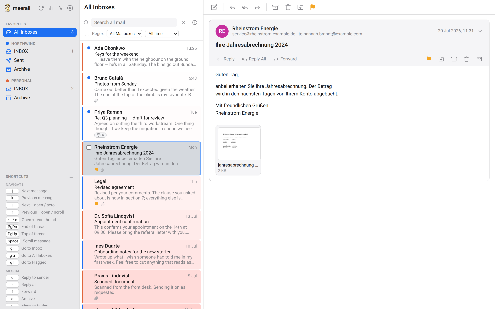

<p align="center">
  
</p>

<h1 align="center">meerail</h1>

<p align="center">The meerail email program — an email client for power users</p>

---

meerail is a fast, self-hosted email client built for all IMAP and SMTP gateways (including the Proton Mail Bridge),
with **regex search over your whole mailbox** (attachment text included), conversation
**threading**, two-way sync, compose/reply/forward, and everything stored in **PostgreSQL**
for analytics. Runs on Linux, macOS and Windows.

**Features:** three-pane Apple-Mail-style UI · unified inbox across accounts · conversation
threading · POSIX-regex & keyword search (scope + "last N years" window, `:unread` / `:read` /
`:has-attachment` / `:from` / `:to` filters, searches PDF/Office attachment text via Tika) ·
every result says **which folder it was found in**, and each message in a thread says where it
is filed — Trash included · sandboxed HTML rendering that blocks every remote fetch a message
can ask for — the images, and the CSS that would otherwise fetch them for it · read/flag/
archive/delete and compose that **sync back to your mail server** over IMAP/SMTP · file a mail
as a **Meerato task**, attachments and all · optional **AI help** — write the search query from
a description, ask anything about a whole conversation, have a reminder time suggested from
what the thread says, explain an attachment (Claude, OpenAI, or any OpenAI-compatible endpoint
including a local Ollama) · light + dark, following the system or pinned to either in Settings.

<p align="center">
  
</p>

It splits into three pieces:

- **`meerail-agent`** — runs on the machine with Proton Bridge and owns the whole write path:
  it speaks IMAP/SMTP to Bridge, parses and threads your mail, extracts attachment text via
  Tika, and writes it into Postgres. Your Bridge credentials never leave the host.
- **`meerail-server`** — the web layer in Docker: FastAPI + the Apple-Mail-style UI. It only
  reads from the database and enqueues your actions; it never fetches or parses mail.
- **`core`** — the shared library both import: models, parsing, threading, ingest, Tika.

## Background

meerail started from two things web mail cannot do: search your mail the way you search
code, and keep it somewhere you can query.

**Regex, not "search".** Every mail client offers substring matching over headers and, if
you are lucky, bodies. meerail pushes POSIX regular expressions straight down into
Postgres, over a corpus that already includes the extracted text of your PDF and Office
attachments — so `invoice.*2024` finds the invoice inside the attachment, not just mails
that happen to say "invoice". A trigram index keeps that honest on a mailbox of tens of
thousands of messages.

**Postgres as the store, not a cache.** Mail lives in a real database — raw MIME,
attachment bytes, parsed headers, threading, the search corpus. That means you can point
psql (`make psql`) at years of correspondence and ask questions no email client exposes.
It also means there is no shared filesystem to keep in sync and no proprietary on-disk
format to reverse-engineer later.

**A split that keeps credentials on your machine.** Proton Mail Bridge only listens on
`127.0.0.1`, which forces the design in a useful direction: the agent runs natively beside
Bridge and owns the entire write path, while the server runs in Docker and only ever reads
from the database. Your mail password never enters a container, and the web layer has no
code path that could send it anywhere. The two halves share nothing but Postgres — the
agent writes, the app reads, neither calls the other.

It is not Proton-specific. The agent speaks plain IMAP and SMTP, so Gmail (with an App
Password), Fastmail, or any ordinary mail host works the same way; Bridge is just the case
that shaped the architecture.

## Requirements

| | |
| --- | --- |
| **Docker** | Engine 24+ with the Compose v2 plugin (`docker compose`, not `docker-compose`). Docker Desktop on macOS/Windows. The only hard requirement for the [`meerail.sh`](#install-the-quick-way) install. |
| **Python** | 3.11 or newer on the host — only for the agent, and only when running it outside Docker (the clone-and-build path). 3.11 is the floor (`tomllib`); 3.13/3.14 are tested. |
| **Node** | 20+, only if you want the Electron desktop app rather than the browser. |
| **RAM** | ~6 GB free for the stack as shipped. Postgres is capped at 10 GB and Tika at 3 GB in `docker-compose.yml`, tuned for a ~32 GB host — lower `shared_buffers` and the `deploy.resources.limits` if your machine is smaller. |
| **Disk** | Sized to your mailbox. Raw MIME plus attachment bytes plus the trigram index runs to tens of GB for a large account — [the content window](#the-content-window) and `agent.store_raw_mime` are the two knobs that bound it. |
| **Mail access** | Proton Mail Bridge running and unlocked, **or** any IMAP+SMTP account. Gmail needs 2-Step Verification, an App Password and IMAP enabled — your normal password will not work. |

Tika's `-full` image bundles Tesseract and is a multi-GB pull; it is what OCRs
scanned PDFs and image attachments. Switch to `apache/tika:4.0.0` in
[`docker-compose.yml`](docker-compose.yml) if you want a much smaller image and can live
without OCR — text extraction still works, images just come back empty.

## Install: the quick way

No clone, no build, no Python on your machine — one script that asks what it needs, writes
a configuration, and runs the published containers.

```bash
curl -fsSL https://raw.githubusercontent.com/ribalba/meerail/main/meerail.sh -o meerail.sh
bash meerail.sh
```

It checks Docker is there, asks where your mail lives, sizes Postgres and Tika to the
memory Docker actually has, pulls `ribalba/meerail-{server,agent,tika}` from Docker Hub and
starts them. Everything it writes lives in `~/.meerail` (override with `MEERAIL_HOME`);
your mail lives in Docker volumes.

**Proton Mail works here too, on every OS.** Choose Proton and the installer runs
[Bridge as a container](docker-compose.hub.yml) beside the rest of the stack and walks you
through its one-time interactive login. The agent then reaches it at `bridge:143` over the
compose network — so the "Docker Desktop can't see Bridge on your loopback" problem that
shapes the clone-based install below simply does not arise. Any other IMAP/SMTP account
works the same way, with Gmail, Fastmail and iCloud servers filled in automatically from
your address.

Afterwards:

```bash
bash meerail.sh status      # containers, version, URL
bash meerail.sh logs agent  # watch the first sync work through your mailbox
bash meerail.sh test        # check every connection: database, Tika, IMAP, SMTP
bash meerail.sh requeue     # re-queue anything an older agent gave up on
bash meerail.sh update      # pull the newest release and restart
bash meerail.sh config      # edit meerail.toml, then restart
bash meerail.sh help        # everything else
```

Windows: run it inside WSL2 or Git Bash, with Docker Desktop running.

The running app tells you when a new version is out — a strip in the sidebar, from a
once-a-day check the server makes against this repository; the strip links to
[How to update](#how-to-update). It sends nothing about you or your mail, and
`update_check = false` under `[server]` turns the request off entirely.

## Quick start from a clone

The developer path: build the images from this checkout and run the agent on your own
Python. Use this if you are changing meerail, not just running it.
**[Running it on your platform](#running-it-on-your-platform)** below has the per-OS
detail, including PowerShell commands for Windows and how to keep the agent running at
boot.

```bash
# 1. One config file for the whole system — server and agent both read it.
#    Fill in your Bridge host/ports + credentials under [[agent.account]].
cp meerail.example.toml meerail.toml
chmod 600 meerail.toml               # it holds your mail password in plaintext
cp .env.example .env                 # just the Postgres container's credentials

# 2. Start the backing services + web app (Postgres, Tika, server). All three are
#    published on 127.0.0.1, which is where the agent looks for them — and, for
#    the web app, the only safe default: it is unauthenticated until you set
#    server.password. See "Reaching it from another machine" below.
docker compose up -d

# 3. Run the agent next to Proton Bridge — it does the syncing and the parsing,
#    writing straight into Postgres.
cd agent
./run.sh --once                       # first full sync; then run ./run.sh to stay live

# 4. Open the app — accounts the agent syncs appear automatically
open http://localhost:8000

# 5. (optional) Native desktop app instead of the browser
cd electron && npm install && npm start
```

See [`agent/README.md`](agent/README.md) for the agent, [`electron/README.md`](electron/README.md)
for building desktop installers, and [`tests/README.md`](tests/README.md) for the test suite.

## Running it on your platform

This section is about the **clone-and-build** install. If you used
[`meerail.sh`](#install-the-quick-way) none of it applies: Bridge runs as a container
there, everything is on one Docker network, and the three platforms are the same install.

From a clone the split is: **the stack runs in Docker, and Proton Bridge runs natively** —
as a desktop app it listens on `127.0.0.1`, and only a container sharing that loopback can
reach it. The only question each platform answers differently is *where the agent runs*.

|             | Postgres · Tika · server | agent                               | desktop app         |
| ----------- | ------------------------ | ----------------------------------- | ------------------- |
| **Linux**   | Docker                   | Docker (host network) **or** native | Electron or browser |
| **macOS**   | Docker Desktop           | native (launchd) — Docker can't see Bridge | Electron or browser |
| **Windows** | Docker Desktop (WSL2)    | native — Docker can't see Bridge    | Electron or browser |

On macOS and Windows, Docker Desktop runs containers inside a Linux VM, so a container's
`127.0.0.1` is the VM's loopback — not the one Bridge is listening on. `network_mode:
host` does not change that; it joins the VM's namespace. Hence: native agent on those two.

### Linux

Everything can be containerised, including the agent.

```bash
cp meerail.example.toml meerail.toml   # Bridge host/ports + credentials
chmod 600 meerail.toml                 # it holds your password in plaintext
cp .env.example .env                   # Postgres container credentials only

make agent-docker                      # whole stack + agent, host network
make agent-test                        # verify every connection
```

`make agent-docker` brings up Postgres, Tika, the server *and* the agent with the
[`docker-compose.agent.yml`](docker-compose.agent.yml) overlay: host networking, so
`127.0.0.1` inside the container is your machine, and `restart: unless-stopped` so the
agent comes back after a reboot. Sharing the host's network means the agent is *not* on
the compose network, which is why the base file publishes Postgres and Tika on loopback —
the container reaches them there rather than at `db:5432` / `tika:9998`.

Prefer it native? `cd agent && ./run.sh` — and see [`agent/README.md`](agent/README.md)
for the systemd user unit that keeps it alive.

### macOS

Stack in Docker Desktop, agent on your host Python.

```bash
brew install --cask docker                # if you don't have Docker Desktop
cp meerail.example.toml meerail.toml      # Bridge host/ports + credentials
chmod 600 meerail.toml
cp .env.example .env
make up                                   # Postgres, Tika, server — the first two
                                          # published on 127.0.0.1 for the agent
cd agent
./run.sh --test                           # check every connection first
./run.sh --once                           # first full sync
./run.sh                                  # then stay live
open http://localhost:8000
```

`run.sh` builds the venv and puts the repo root on `PYTHONPATH` for you.

Once that works, hand it to launchd so it runs in the background instead of tying up a
terminal:

```bash
./service.sh install                      # or: make agent-service
./service.sh status                       # running? plus the last few log lines
./service.sh logs                         # tail -f
```

That generates a **LaunchAgent** with this checkout's paths, starts the agent at login and
restarts it if it dies. It has to be a LaunchAgent rather than a LaunchDaemon, since Bridge
only runs inside your logged-in session — see
[`agent/README.md`](agent/README.md#macos--launchd) for the rest of the commands and what
the plist sets.

### Windows

Stack in Docker Desktop (WSL2 backend), agent natively in PowerShell. There is no
`run.sh` equivalent, so the venv is built by hand once:

```powershell
copy meerail.example.toml meerail.toml    # then edit: Bridge host/ports + credentials
copy .env.example .env
docker compose up -d

cd agent
py -3 -m venv .venv
.\.venv\Scripts\pip install -r requirements.txt
$env:PYTHONPATH = (Resolve-Path ..).Path  # the agent imports the shared `core` package
.\.venv\Scripts\python main.py --test     # check every connection first
.\.venv\Scripts\python main.py --once     # first full sync
.\.venv\Scripts\python main.py            # then stay live
start http://localhost:8000
```

Everything lives on Windows' own loopback — Bridge, and the Postgres/Tika ports Docker
Desktop publishes there — so the default `127.0.0.1` addresses in `config.toml` work as
written.

Two Windows-specific notes: `PYTHONPATH` must be set for whatever launches the agent
(a new shell won't have it — make it a persistent user variable), and `chmod 600` has no
NTFS equivalent, so `--test` reports the config-permission check as a warning instead of
enforcing it; check the ACLs with `icacls config.toml` if others use the machine. For
start-at-login, [`agent/README.md`](agent/README.md#windows--task-scheduler) has a
**Task Scheduler** recipe.

The Electron wrapper works here too — `cd electron && npm install && npm start`, and
`npm run dist` produces an NSIS installer (build it *on* Windows; electron-builder needs
the native toolchain for that target).

## How to update

The app tells you when a newer version is out — a strip in the sidebar, from a once-a-day
check the server makes against [`VERSION`](VERSION) on this repository's default branch.
This is what to do about it. Which of the two paths applies depends on how you installed;
[Versions and releases](#versions-and-releases) explains what a version *is*.

**Your mail is not at risk either way.** Everything lives in Docker volumes (or your own
Postgres), not in the images, and the server runs the schema migrations itself on first
boot. Updating is: pull new images, restart, done. There is no export/import step, and
downgrading is only safe back to a version whose schema you have not yet migrated past —
so if you want a way back, snapshot the database first (`docker compose exec db pg_dump …`).

### If you installed with `meerail.sh`

```bash
bash meerail.sh update      # reads VERSION, pins ~/.meerail/.env to it, pulls, restarts
bash meerail.sh status      # installed vs. latest, and the containers
```

`update` also refreshes `~/.meerail/docker-compose.yml` from the release, so a new service
or a renamed variable comes along with it — this is why you should not update by running
`docker compose pull` in `~/.meerail` by hand. The script itself is the one thing it does
not replace; re-download it if a release note says to:

```bash
curl -fsSL https://raw.githubusercontent.com/ribalba/meerail/main/meerail.sh -o meerail.sh
```

Your configuration (`~/.meerail/meerail.toml`) is never touched. New settings take their
defaults; [Configuration](#configuration) lists them, and `meerail.example.toml` in the
repository is the annotated reference.

### If you installed from a clone

The images are built from your checkout, so updating is a pull and a rebuild:

```bash
git pull
docker compose up -d --build      # rebuild server + tika, restart
```

Then update the agent to match — it shares the `core` package with the server, and running
a stale agent against a migrated database is the one combination worth avoiding:

* **native agent** (macOS, Windows, or by choice on Linux): stop it, `cd agent && ./run.sh
  --once` — `run.sh` reinstalls `requirements.txt` into the venv before it starts — then
  `./run.sh` to stay live. Under launchd or systemd: `./mac_service.sh restart` (macOS) or
  `systemctl --user restart meerail-agent` (Linux), after the venv has been refreshed once.
* **containerised agent** (Linux, `make agent-docker`): `make agent-docker` again rebuilds
  and restarts it with the rest of the stack.

Check `git log --oneline` for anything that touches `meerail.toml` — if
`meerail.example.toml` grew a key you care about, copy it across; nothing breaks if you
don't, since every setting has a default. Migrating from a pre-`meerail.toml` layout is
[its own section](#upgrading-from-the-two-file-layout).

Then `make agent-test` (or `./run.sh --test`) to confirm database, Tika, IMAP and SMTP all
still answer, and reload the browser tab — the frontend is served fresh, but a long-open
tab is still running the old JavaScript.

### Running a specific version, or none

`MEERAIL_VERSION` in `~/.meerail/.env` is what the compose file resolves images against.
Set it to any published tag to move deliberately rather than to whatever is newest:

```bash
MEERAIL_VERSION=0.5.0            # a release
MEERAIL_VERSION=0.5.0-a1b2c3d    # one exact build, immutable
```

then `docker compose --env-file ~/.meerail/.env -f ~/.meerail/docker-compose.yml up -d`.

To stop being told about updates at all, set `update_check = false` under `[server]` in
`meerail.toml` and restart — the server then makes no outbound request whatsoever. The
notice can also just be dismissed in the sidebar, which silences that one version and lets
the next one speak up.

### Desktop app

The Electron wrapper is a window onto the server, so updating the stack updates what you
see. The wrapper itself only changes when you rebuild it — `cd electron && npm install &&
npm run dist` from an updated clone, or reinstall the installer from a newer release.

## Architecture

```
 host with Proton Bridge                         Docker
 ┌────────────────────────────┐             ┌──────────────────────────┐
 │  meerail-agent             │   writes    │  Postgres (pg_trgm)      │
 │  IMAP/SMTP ↔ Bridge        │ ──────────▶ │  mail · blobs · queue    │
 │  parse · thread · index    │             └──────────────────────────┘
 │  Tika ↔ attachment text    │                    ▲ reads   │ NOTIFY
 │  drains the action queue   │             ┌──────┴──────────▼───────┐
 └────────────────────────────┘             │  meerail-server         │
                                            │  FastAPI · SPA          │
                                            └─────────────────────────┘
                                                   ▲ browser / Electron
```

The database is the only thing the two halves share: the agent writes, the app reads, and
neither calls the other. Live UI updates ride Postgres `LISTEN/NOTIFY`, so the browser still
refreshes the moment mail lands even though ingest happens in another process.

Content is stored once per message with per-folder placement tracked separately (handling
Proton exposing labels as folders). What "once per message" means is a hash of the message
itself, not its Message-ID: an id is a header the sender writes, so two mails that hash the
same are the same mail whatever their headers claim, and two that do not are stored
separately, under their bytes, in conversations of their own. (Where there is nothing to hash
— a message stored from its headers alone — sender, subject and send time stand in until the
body arrives.) That is why a label server's second copy of a message is still downloaded: it
costs a fetch to prove it is the same one, and the alternative is trusting a header for it. Raw MIME and attachment bytes live in the database, so there is no shared
filesystem between the agent and the app. Sync cursors live in the database too, so the agent
stays stateless — stop and restart it anytime.

### What is exposed

Every container sits on one Docker network, `meerail`, and addresses the others by service
name. **Nothing is published beyond `127.0.0.1` by default** — the server included, so a
fresh stack is reachable from this machine and not from the LAN.

| Service | Address on the `meerail` network | Published on the host |
| --- | --- | --- |
| `server` | `server:8000` | `127.0.0.1:8000` — browser / Electron |
| `db` | `db:5432` | `127.0.0.1:5432` — loopback only |
| `tika` | `tika:9998` | `127.0.0.1:9998` — loopback only |

The two backing loopback bindings are what a **natively-run agent** needs: it is not on the
compose network, so `db` and `tika` do not resolve for it. Same for the host-network agent
container and for `make dev`. Neither service authenticates a caller worth the name (the
shipped Postgres password is `meerail`; Tika will extract whatever anyone POSTs it), so if
you edit those port lines, keep the `127.0.0.1:` prefix — without it Docker publishes on
`0.0.0.0` and punches straight through the host firewall, whose rules Docker's own bypass.

#### Reaching it from another machine

The server is on that list for the same reason, and a stronger one: **the UI has no
authentication until you give it a password.** With none set, anyone who can open port 8000
can read every message in the mailbox, search it, and queue deletes that the agent will
then apply to the real server. So exposing it is two steps, in this order:

1. Set `password` under `[server]` in `meerail.toml` (or `SERVER_PASSWORD` in the
   environment), and restart the server.
2. Set `MEERAIL_BIND=0.0.0.0` in `.env` and `docker compose up -d`.

Off a network you trust, put a TLS terminator in front of it as well. This is not optional once
a password is set: meerail refuses to serve anything over a plaintext connection to a non-loopback
address, because handing over the page is what puts the password on the wire. Tell it about the
terminator with `trusted_proxies`, or every request arrives looking like plaintext. `meerail.sh`
asks the same question at install time and refuses to widen the binding until a password is set.

If that terminator is Coolify, [`COOLIFY.md`](COOLIFY.md) and
[`docker-compose.coolify.yml`](docker-compose.coolify.yml) deploy the whole stack —
Bridge included, in a container — as one resource, with Traefik in front and nothing
else published. It moves your mail credentials onto the server, which is the one thing
the layout above is built to avoid; that file opens by saying so.

## Configuration

**One file: `meerail.toml`.** The server and the agent both read it — the server takes
`[database]` and `[server]`, the agent takes `[database]` and `[agent]`, and each ignores
the other's section. Copy from
[`meerail.example.toml`](meerail.example.toml) and `chmod 600` it: it holds your mail
password in plaintext, and the agent's `--test` warns you if the permissions are loose. It
is gitignored, so credentials cannot be pushed by accident.

Every setting can also be given as an environment variable of the same name in upper case
— `server.password` is `SERVER_PASSWORD`, `database.url` is `DATABASE_URL`,
`agent.store_raw_mime` is `STORE_RAW_MIME`. The order is:

```
environment  >  .env  >  meerail.toml  >  built-in default
```

The environment winning is what lets a remote server run with **no file at all**: drop the
bind mount from [`docker-compose.yml`](docker-compose.yml) and pass `DATABASE_URL` and
`SECRET_KEY` in the environment instead. It is also why the compose files set only the
handful of values that are genuinely container topology — a variable with a
`${VAR:-default}` fallback is *always* set, so listing one there would silently override
whatever you wrote in the file.

`.env` still exists, but only for the part that cannot live in TOML: `docker compose` reads
it to expand `${...}`, and the Postgres image takes its credentials from the environment and
nowhere else. Copy [`.env.example`](.env.example) and leave it at the three `POSTGRES_*`
keys unless you specifically want a per-machine override.

### `[database]`

| Key | Env | Default | What it does |
| --- | --- | --- | --- |
| `url` | `DATABASE_URL` | local Postgres | The only channel between the agent and the web app. Containers on the compose network are handed `db:5432` in their environment, which overrides this. If you change `POSTGRES_PASSWORD` in `.env`, change it here too — the Postgres image only takes credentials from the environment, so that one value genuinely does live in two places. |

### `[server]`

| Key | Env | Default | What it does |
| --- | --- | --- | --- |
| `secret_key` | `SECRET_KEY` | `dev-insecure-…` | Signs tokens and encrypts any server-side stored credentials. **Change it** before exposing the app: `python -c "import secrets;print(secrets.token_urlsafe(48))"`. |
| `password` | `SERVER_PASSWORD` | *(empty)* | Empty means no auth — correct for a localhost app. Set it if the server is reachable from anywhere else: the UI then shows a password screen, and a successful login holds a signed session cookie for `session_max_age_days`. **Setting it also requires HTTPS for everything**, not only for signing in: with a password configured, a plaintext request never gets the page, because getting the page is what puts the password on the wire. A plain `http://` GET is redirected to `https://`; anything else is refused. Loopback is exempt, and TLS terminated by a proxy needs `trusted_proxies` below. Failed logins are rate-limited per address (5 per 15 minutes), and **Log out really ends the session**: the cookie names a row on the server, so a copy of it taken elsewhere stops working the moment you log out. Logging out in one browser leaves your other browsers signed in. |
| `api_token` | `API_TOKEN` | *(empty)* | Credential for scripted clients: `Authorization: Bearer <token>`. Empty means the API can only be reached with a browser session. Deliberately **not** the UI password — that used to be accepted here too, which made the thing you type into a browser a permanent key to the whole mailbox, revocable only by changing the password and signing every browser out. Generate one with `python -c "import secrets;print(secrets.token_urlsafe(32))"`, and change it when a script should stop having access. |
| `session_max_age_days` | `SESSION_MAX_AGE_DAYS` | `30` | How long a browser login lasts before the password is asked again. Changing `password` or `secret_key` logs every browser out immediately. |
| `trusted_proxies` | `TRUSTED_PROXIES` | *(empty)* | Reverse proxies this server may believe about where a request came from — IPs or CIDR blocks, comma-separated. Empty trusts nothing, which is right when the browser reaches the server directly. **Set it whenever TLS is terminated in front** (Traefik, Caddy, nginx): without it every request looks like plain HTTP from the proxy's own address, so the session cookie goes out without `Secure` and the login rate limiter counts one attacker's failures against everyone behind the proxy. Only these addresses are believed — anything that can reach the port can set `X-Forwarded-For`. With a password set and this unset, the app cannot tell an encrypted request from a plaintext one and answers every request with a 421 naming this setting, rather than guessing. |
| `hsts_max_age_days` | `HSTS_MAX_AGE_DAYS` | `365` | How long a browser remembers to reach this hostname over HTTPS only (`Strict-Transport-Security`), which removes the *first* plaintext request rather than turning it away. Sent only over HTTPS, so a localhost install never sees it. It is a promise browsers keep: for this long they will not speak `http://` to this name, and will not offer a way past a bad certificate. Set `0` while you are still moving the install between hostnames. `includeSubDomains` is deliberately not sent — add it at your proxy if the whole domain is yours to commit. |
| `max_request_bytes` | `MAX_REQUEST_BYTES` | `8388608` | Ceiling on ordinary (JSON) request bodies; `0` is no limit. Uploads to the composer get `max_attachment_bytes` instead. Enforced before the body is read **and before it is authenticated** — FastAPI parses a request body before it runs the dependency that would have said 401, so without this a stranger chooses what an unauthenticated POST costs the server. A reverse proxy should cap bodies too; see [COOLIFY.md](COOLIFY.md). |
| `meerato_allow_private_hosts` | `MEERATO_ALLOW_PRIVATE_HOSTS` | `false` | Let "Add Task" point at a Meerato on a private address (`10.x`, `192.168.x`, a container name, localhost). The URL is typed into Settings and fetched *by the server*, so leaving this off is what stops it being a way to aim this machine at whatever else is on its network. Turn it on when Meerato really is a peer service on your own network. |
| `llm_allow_private_hosts` | `LLM_ALLOW_PRIVATE_HOSTS` | `false` | Let the **Other (OpenAI-compatible)** AI provider point at a private address — which is what running a model locally means (Ollama on `127.0.0.1:11434`, LM Studio on `:1234`). Off by default for the same reason as `meerato_allow_private_hosts`: the base URL is typed into Settings and fetched *by the server*. Turn it on if your model is local; leave it off on anything internet-facing. Anthropic and OpenAI are fixed addresses in the code and are unaffected. |
| `llm_timeout_seconds` | `LLM_TIMEOUT_SECONDS` | `180` | How long to wait for a model to answer. Generous on purpose — a long thread is tens of seconds of thinking before the first byte. Only the read side; failing to *reach* a provider still gives up in ten seconds. |
| `llm_max_thread_chars` | `LLM_MAX_THREAD_CHARS` | `240000` | The most of one conversation "Ask AI" may send, in characters (roughly four to the token). A longer thread keeps its most recent end, and the dialog says how many messages were left out. |
| `llm_max_image_bytes` | `LLM_MAX_IMAGE_BYTES` | `3500000` | The largest image "Explain this attachment" will send. Both hosted providers cap what they accept and answer an oversized one with an opaque 400, so it is refused here instead — by name, with the size said out loud. |
| `llm_max_attachment_chars` | `LLM_MAX_ATTACHMENT_CHARS` | `120000` | How much of one attachment's extracted text to send. A scanned contract runs to hundreds of pages; the dialog says when a file was cut. |
| `default_search_years` | `DEFAULT_SEARCH_YEARS` | `0` | Default search window; `0` searches everything. The UI can override per query. |
| `contacts_scan_years` | `CONTACTS_SCAN_YEARS` | `1` | How far back to scan addresses for compose autocomplete; `0` is all time. |
| `max_attachment_bytes` | `MAX_ATTACHMENT_BYTES` | `104857600` | Per-attachment cap for outgoing uploads. |
| `data_dir` | `DATA_DIR` | `./data` | Scratch space for staging outgoing attachments. Mail bytes live in Postgres. Every container overrides it to `/data`. |
| `update_check` | `UPDATE_CHECK` | `true` | Once a day, fetch [`VERSION`](VERSION) from this repository's default branch and let the UI say so if it is newer than the running build. The only outbound request the server makes, and it carries nothing but the request — no identifier, no version, no statistics. `false` makes no request at all. See [How to update](#how-to-update) and [Versions and releases](#versions-and-releases). |

### `[agent]`

| Key | Env | Default | What it does |
| --- | --- | --- | --- |
| `tika_url` | `TIKA_URL` | `http://127.0.0.1:9998` | Attachment text extraction endpoint, called by the agent. |
| `poll_interval` | `POLL_INTERVAL` | `30` | Seconds between IDLE cycles. |
| `reconcile_interval` | `RECONCILE_INTERVAL` | `900` | Seconds between full flag/prune sweeps. |
| `batch_size` | `BATCH_SIZE` | `200` | UIDs per fetch/ingest batch. An account may override it. |
| `store_raw_mime` | `STORE_RAW_MIME` | `true` | Keep each message's original RFC822 bytes in `messages.raw_mime` — held for future features, and roughly half the database. `false` ingests without them. Takes effect for mail synced from then on; existing rows keep their copy. |
| `max_message_bytes` | `MAX_MESSAGE_BYTES` | `104857600` | Largest incoming message the agent will hold in memory to store it; `0` is no limit. A fetch reads the whole message before it is parsed, so one mail carrying somebody's backup is that many bytes resident at once — and the pass dies on the same UID every time it retries. Past the cap the message is stored as headers alone, exactly as mail outside the content window is; raising it and running a recheck brings the body in. |
| `content_window_months` | `CONTENT_WINDOW_MONTHS` | `0` | Keep the *content* of mail sent within this many months; `0` keeps everything. See [The content window](#the-content-window). |

Then one `[[agent.account]]` block per address — IMAP and SMTP host/port/security, username
(defaults to `email`), password, `verify_cert` (`false` for Bridge's self-signed cert, `true`
for a real one), an optional `batch_size` that overrides the global one for that account
(Gmail answers a 200-message fetch with UIDs missing or by dropping the connection — `25` is
a good starting point there), and an optional `addresses = [...]` list of aliases to offer in
the composer's *From*. Accounts register themselves in the app on first sync; there is
nothing to add in the UI. The example file carries a commented-out Gmail block alongside the
Proton one.

`name = "Your Name"` sets the display name recipients see in front of the address; without it
mail goes out as the bare address. It applies to every address the account sends from, and an
entry in `addresses` written as `Name <alias@example.com>` overrides it for that one — listing
the primary `email` there is how it gets a name of its own. This is not the account *label* in
Settings, which names the account in the sidebar and never leaves the UI.

`label`, `color` and `footer` pin that UI-side presentation from the file: the account's name
in the sidebar, the colour of its dot, and the footer the composer prefills. All three are
normally edited in Settings → Accounts and left out of the file. Set one here and the file
owns it — the agent writes it onto the account on every pass, and Settings shows it as
configured rather than editable, since it would otherwise take a change that the next sync
silently undid. Delete the key again and Settings takes it back, keeping the value the file
last gave it. `footer = ""` is an answer, not an omission: it means this account has no
footer. Handy when accounts are provisioned from a file rather than set up by hand.

### Removing an account

There is no button for this, deliberately: it is the one operation that takes an account's
mail away wholesale, and nothing puts it back. It also takes more than one step, because two
things own an account. `meerail.toml` decides that it exists — the agent inserts the row on
its first pass, keyed on the address — and the database holds everything it has synced since.
Doing one without the other does not work: delete the rows while the file still names the
account and the agent recreates it on the next pass, and take it out of the file alone and
its mail sits in the app forever with nothing keeping it up to date.

**1. Let it finish.** Everything below is cascaded away by the database, queued work
included: a message still in the Outbox and a move that has not reached the server yet go
with the account, unsent and unapplied. So check the Outbox is empty and give the agent a
pass to drain its queue — the agent-status panel counts what is still waiting, above the
per-account cards. This is the only step that is about your mail rather than about meerail.

**2. Stop everything.**

```bash
./meerail.sh stop            # from a clone: docker compose stop
```

The agent is the thing that would put the account back, so it has to be down while the file
is edited. If it runs natively next to Bridge rather than in a container, stop *that* — the
script only knows about containers.

**3. Take the account out of the config.**

```bash
./meerail.sh config          # or open meerail.toml in your editor
```

Delete that address's whole `[[agent.account]]` block. Nothing else in the file names it.

**4. Start again.**

```bash
./meerail.sh start
```

The agent comes up without the account. The app still shows it, because its mail is still in
the database — which is the last step.

**5. Delete the rows.**

```bash
./meerail.sh psql            # from a clone: docker compose exec db psql -U meerail -d meerail
```

```sql
SELECT id, email, label FROM accounts ORDER BY id;
DELETE FROM accounts WHERE email = 'you@example.com';
```

One statement is the whole job. Every table hanging off an account is `ON DELETE CASCADE`,
so the row takes its mailboxes, messages, threads, reminders, queued actions and outbox
entries with it, and those messages take their recipients, attachments and folder placements
— there is nothing left over to find later. On a large account it takes a while, and it is
not undoable: `./meerail.sh backup` first if you might want to change your mind.
`DELETE /api/accounts/{id}` is the same delete from the API side.

Two things afterwards. **Contacts outlive it** — the autocomplete index is keyed on address
rather than account and rebuilt every six hours, so addresses you only ever saw on that
account keep being offered until it is; restarting the server rebuilds it at once. And **the
volume does not shrink**: Postgres reuses the freed space for new mail rather than handing it
back to the disk, so a [`backup` and `restore`](#backing-up-and-restoring) pair is what
returns it if you need the room.

An **imported** account — one from `tools/import_mbox.py`, with no mail server behind it —
has no config entry to remove, so steps 2 to 4 do not apply and step 5 is the whole
procedure. Its mail is not a copy of anything, though, so that delete takes the only copy.

### Upgrading from the two-file layout

Before this, settings lived in `.env` *and* `agent/config.toml`, with `STORE_RAW_MIME` and
`CONTENT_WINDOW_MONTHS` in both ([issue #1](https://github.com/ribalba/meerail/issues/1)).
`agent/config.toml` is no longer read. Fold an existing install into one file with:

```bash
python -m core.config migrate
```

It reads your `.env` and `agent/config.toml`, writes `meerail.toml` at mode 0600 with the
values that install was actually running with, and tells you what to do next. The agent
refuses to start until you have run it.

### Upgrading from the on-disk layout

The first version of meerail kept message bodies as `.eml` files and attachment payloads as
files beside them, with the paths in `messages.raw_path` and `attachments.disk_path`;
everything since keeps those bytes in Postgres, so the agent and the web app need no shared
filesystem. If your database still has those columns, the server says so on startup:

```
[init_db] 4812 row(s) in attachments still point at files on disk (attachments.disk_path).
```

Bring them in, on the machine that can see those paths:

```bash
tools/migrate_blobs.py            # what it would copy
tools/migrate_blobs.py --apply
```

Nothing on disk is deleted, and a file it cannot read keeps its path so the run can be
repeated with the volume attached. Once a path column is empty the next start drops it —
and until then it is left alone, because it is the only record of where that content is.

### The content window

A full mailbox is tens of GB, and most of it is mail nobody will open again. Set
`agent.content_window_months` to keep the *content* of recent mail only:

```toml
[agent]
content_window_months = 24   # bodies and attachments for the last two years
```

Older mail is still synced — it just arrives as headers alone. It lists, sorts, threads,
counts towards the folder totals and turns up in a search for its subject or correspondent;
it has no body to open, and the reader says so instead of showing a blank message. The body
never crosses the wire: the agent reads each message's arrival time in the header pass it
already makes, and never asks for the rest.

"Old" means *when it arrived*, not what its `Date:` header claims. The header is written by
whoever sent the message, so a window measured on it could be aimed — date a message 1998 and
its body would be stripped on the very pass that stored it, leaving a mail that lists and
never opens. The clock is the server's own `INTERNALDATE`, which nobody but the server sets.
The reader still shows and sorts by the `Date:` header, because that is what the message says
about itself.

The window **slides**, which is what makes it a ceiling rather than a one-off tidy-up. Mail
already stored is stripped back to headers once it falls out of the window — body, HTML,
attachment payloads, previews and extracted text all go, and the attachment names and sizes
stay. That runs on the agent's indexer thread, so it keeps happening on a mailbox where no
new mail is arriving.

Nothing is deleted from your mail server. Widening the window applies to new mail
immediately; to pull back content for mail that was already skipped, widen it and then run a
full recheck from the UI's agent-status panel, which re-walks every folder.

### The AI features

Four of them, all optional and all off until you configure a model. Nothing is sent anywhere
until you press one of the buttons — there is no background summarising, no indexing through
a provider, and no request at all on an install that has not set one up. With nothing
configured, the robot beside the search box is the one that stays: pressing it opens a note
saying what the four would do and what they need, including how to point meerail at an Ollama
running on your own machine. The rest appear once a model is saved.

**A robot beside the search box** opens a small dialog: describe the mail you are after in
your own words, and the query comes back **into the search box** rather than being run behind
your back. That is deliberate — meerail's search is powerful and writing it is the hard part,
so the point is to see the syntax written for something you actually wanted. *Search with
this* runs it; *Put it in the box* leaves the cursor in the field so you can tighten it first.
Only your description is sent, never your mail.

**A robot in the reading pane** flattens the whole conversation to text and asks a model about
it. Four one-click instructions — summarise, what do I need to do, draft a reply, explain it
to me — and a box for anything else ("in German", "as three bullet points"). The answer comes
back as text; *Put it in a reply* or *Put it in a new message* drops it into the composer as
an ordinary draft, above the quote and your footer. **Nothing is ever sent for you.** The
dialog says how many messages will go before you press anything, and says afterwards if a long
thread did not fit (the most recent end is kept). Attachment *names* travel with the thread;
their contents do not. `Bcc` is stripped.

**Suggest a time**, in the *Remind me later* menu, reads the conversation and proposes when it
should come back — anchored to what the thread actually says ("Ada's invoice is due on the
14th — this brings it back the morning before") rather than to a fixed offset. It appears as
one more row in the menu, alongside *Tomorrow* and *Next week*: a moment to choose, not a
decision taken for you. Nothing is filed until you click it.

**A robot beside each attachment** explains the file. A PDF, Word file or spreadsheet goes as
the text Tika already extracted for the search index — so there is nothing new to extract and
the bytes stay here. A screenshot or photo goes to the model *as a picture*, which the dialog
says before you press anything. The robot is only drawn where there is something to read: a
zip or an unreadable binary gets none, rather than a button whose only honest answer is "there
is nothing here".

Set it up in **Settings → AI**:

| Provider | What to enter |
| --- | --- |
| **Anthropic (Claude)** | Your API key, then *Fetch models* and pick one. |
| **OpenAI** | Same. |
| **Other (OpenAI-compatible)** | A base URL plus (usually) a key. Anything speaking `/chat/completions`: Ollama `http://localhost:11434/v1`, LM Studio `http://localhost:1234/v1`, OpenRouter, Groq, Mistral, or Gemini's compatibility URL. A local model normally needs no key at all. |

The model list is fetched from the provider rather than hardcoded here, so a model released
next month shows up without meerail being updated. If an endpoint has no `/models` route —
common for a self-hosted server with one model — type the name instead; it is saved with a
note rather than refused.

Two things about the key. It is **encrypted at rest** with `server.secret_key` and **never
sent to the browser**: every call is made by the server, so the key is not in the page for an
extension or a screenshot to find. And one key is kept per provider, so trying Claude and then
GPT and going back does not cost you the first one. *Turn off* forgets all of them.

Pointing **Other** at a model on `localhost` or your LAN needs `server.llm_allow_private_hosts
= true` — the base URL is fetched by the *server*, so without that restriction the field would
be a way to aim this machine at whatever else is on its network. The error message says so
when you hit it.

### What meerail deletes, and when

Short version: your mail is deleted when you delete it, when your mail server says it is
gone, or when you delete the whole account. Nothing else removes a message, and nothing
removes one because a connection failed.

| What | When | |
| --- | --- | --- |
| A message you trash or archive | You pressed it | Leaves the folder locally at once and is applied to IMAP on the next pass. It is a move, never a deletion: with no Trash folder on the account the action is refused rather than turned into an expunge. An imported account is the exception — there the Trash folder is meerail's own to make, so it is made and the move goes through. |
| Everything in Trash | You pressed **Empty Trash** — in the folder header, or in the bar over a selection — and confirmed | The thing that destroys mail: `\Deleted` plus a UID `EXPUNGE`, aimed one message at a time. It cannot be reached from any other button — no ordinary delete, however many messages it covers, is ever re-read as this one. On an imported account there is no server to expunge from, so it deletes the rows instead: the message, its raw copy and its attachments. |
| Imported mail you delete permanently | You pressed **Delete permanently** (or Shift+Delete) and confirmed | Imported accounts only, where this app holds the only copy and Trash is a folder in this database and nothing else. The message and everything hanging off it is deleted outright, from every folder it was filed in, with no Undo. Refused on any account a mail server stands behind: there the message here is a copy, and deleting a copy is a delete that undoes itself on the next pass. See [Tidying up after an import](#tidying-up-after-an-import-folders-moving-deleting). |
| One conversation in Trash | You pressed Delete *in Trash* and confirmed | Delete has nowhere further to file something already in Trash, so there it destroys that conversation and nothing else. On an imported account that is the rows; on an account with a server it is `\Deleted` plus a UID `EXPUNGE` on the Trash copy alone, leaving any other label the message wears. Only from Trash — mail anywhere else is refused, so that two keypresses is what it takes rather than one. |
| A folder you delete, and what it holds | You pressed the bin beside it in the sidebar and confirmed | Imported accounts only, for the same reason as the row above. Takes the folders nested under it and the mail filed in them, message rows and all; mail also filed outside the folder keeps that copy. An empty folder with nothing under it goes without a dialog — everything else names its counts and asks first. |
| Mail deleted on your phone or in webmail | The server no longer lists its UID | meerail mirrors the server; a message deleted elsewhere goes here too. Only ever on a UID list the server has confirmed in full — see below. |
| A folder | It has been gone from the server's `LIST` for an hour | Its messages go with it, unless they are also filed elsewhere. Never on an empty `LIST`, and never on one absence: a Bridge that is still loading answers with part of the mailbox, so a folder that disappears is marked and kept — with all its mail — until it stays gone. Never for a folder meerail made itself — an imported account's folders, and any you add to one — which is absent from `LIST` by definition. |
| A message no folder holds any more | At the end of a completed pass, hours after the last placement went | Almost always a reused UID after a `UIDVALIDITY` reset: the walk binds the number to the message that has it now, and the one it used to mean is left with no folder, invisible and still on disk. Never asked mid-pass, when a message is legitimately between folders, and never about one a queued action still names. |
| Bodies and attachments of old mail | `content_window_months` is set | Headers stay; the mail still lists, threads and searches. Off by default. Age is counted from when the mail *arrived* (the server's `INTERNALDATE`), not from its `Date:` header — a header is written by the sender, and a window read from one could be aimed: date a message 1998 and its body would be stripped on the pass that stored it. See [The content window](#the-content-window). |
| Everything for an account | `DELETE /api/accounts/{id}`, or the `DELETE` in [Removing an account](#removing-an-account) | The one command that removes an account's mail wholesale — the mailboxes, the messages, the threads, the reminders and anything still queued. No button in the UI calls it. |

Being offline is never a reason to delete anything, and the agent is written for machines
that are: a laptop that is opened twice a week, a Bridge that has not signed in yet, a mail
server that has been down since Friday.

- **A connection that fails deletes nothing** — the pass ends and the next one picks up.
- **A connection that answers *short* also deletes nothing.** This is the one that bites:
  Proton Bridge keeps serving while it cannot reach Proton, so it will answer `LIST` with no
  folders, with *some* of them, or a folder's `SEARCH` with a fraction of what it holds. The
  agent checks every UID list against the message count `SELECT` reported before it removes
  anything; an empty `LIST` is never read as "every folder was deleted"; and a folder missing
  from one complete-looking `LIST` keeps its mail and is only removed after it has been
  absent for an hour, because a partial answer and a folder somebody really deleted look
  identical until one of them comes back. The log says which folders are being held that way.
- **A new `UIDVALIDITY` does not empty the folder.** Bridge changes it for its own reasons —
  a re-login, a rebuilt cache. The agent re-walks the folder instead; mail it already holds
  is matched by `Message-ID` and keeps its content.
- **And it does not let queued work land on the wrong message.** A UID only means something
  within one `UIDVALIDITY`, so after a reset the number a queued delete is carrying can name
  a message that arrived this morning. Every queued flag, move and delete records the epoch
  it was written in and is checked against the folder the agent has just opened, one command
  before it acts. On a mismatch it is dropped and said out loud — the flag or move is
  re-derived from the mailbox on the next pass, and nothing is deleted on a guess.
- **Filing works offline.** Archive and trash move the message in the app the moment you
  press them, not when the agent gets round to applying it. The copy you see in Archive is
  written locally and replaced by the server's own once the move lands; file the same
  message twice before that and it is still one move, to wherever it ended up.
- **Folders nest where the mail server nests.** The `+` on an account heading takes
  `Archive/2024` and makes `2024` inside `Archive`, creating `Archive` if it is not there —
  up to eight levels, and each level is `CREATE`d in turn so a server that will not invent
  the parents for you gets them anyway. Whether it is offered at all is *the server's*
  answer, read off IMAP's `LIST` by the agent on every pass: Proton Bridge marks every user
  folder `\Noinferiors` and genuinely cannot hold a folder inside a folder, so there the box
  says so; Gmail, Dovecot and the university IMAP servers people run beside it can, and used
  to be refused along with it. You always type `/`; the agent puts the server's own
  separator in (`.` on many Dovecot installs) so nobody has to know what it is. See
  [Nested folders](#nested-folders). A folder meerail owns can also be *removed*: on an
  imported account a bin appears beside the folder name on hover, and takes the folder, the
  folders under it and the mail they hold — the missing half of an import that went in under
  the wrong name.
- **A selection can be filed, not only deleted.** Ticking rows in the list puts a bar above
  it with **Move to…** beside Delete, and the folder you pick takes every ticked
  conversation in one operation — one entry in Recent actions, one Undo. When every loaded
  row is ticked and the folder holds more, the bar offers **Select all N**, and Move then
  means the whole folder including the pages you never scrolled to; that version asks
  first, and runs in chunks so a folder of forty thousand is a progress count rather than a
  request that times out. Moving is within one account, because IMAP has no way to carry a
  message to another server — a selection spanning two accounts (easy to make in the
  unified inbox) simply offers no Move button rather than half-applying one.
- **You can take a filing back.** A **Recent actions** box in the sidebar lists the last
  dozen things that moved mail — trashed, archived, moved — one line per keypress rather
  than per message, so a bulk delete of two hundred conversations is one entry and one
  **Undo** (`z` takes back the newest; press it again to keep walking back). What Undo does
  depends on how far the move has got, and only on that. Before the
  agent has applied it, nothing was ever said to your mail server: the queued move is
  deleted and the message goes back to the folder it came from with the UID and flags it
  had. Once the move has landed and synced, Undo is an ordinary move in the opposite
  direction. In the seconds between the two — the agent holding the row, or the move applied
  and the folder not yet re-read — there is no UID to address the message by, and it says so
  and asks you to press it again in a moment rather than guessing. Emptying the Trash is
  listed too, greyed, because mail deleted from the server is not something any record here
  can bring back.
- **A mail can be put off until later.** *Remind me* (the bell in the reader toolbar, or `b`)
  files the whole conversation into Archive now and puts it back in the inbox, unread, when
  you said — *later today*, *this evening*, *tomorrow*, *this weekend*, *next week* (Monday
  morning), or a date and time you pick. The times are worked out in your own timezone and
  stored as an absolute instant, so a reminder set on the laptop means the same moment when
  it comes back on the phone. A **Reminders** folder appears above Favorites while anything
  is waiting (`g r` any time), every list draws a small clock on a conversation that is
  coming back, and both the bell menu and a strip over the open conversation offer **Bring
  back now** and **Clear reminder** — which are different things: one returns the mail, the
  other leaves it filed and forgets the promise. Setting a second reminder on the same
  conversation only moves the deadline.
- **A reminder is late rather than lost.** The clock is watched by the server, so reminders
  that fell due while it was off fire when it comes back, and the folder goes red while any
  of them is overdue. Nothing about it reaches your mail server directly: parking a
  conversation and bringing it back queue the same move an Archive keypress queues, so an
  unreachable Bridge delays a reminder exactly as it delays everything else. If you file the
  mail somewhere yourself while it waits, that wins — the reminder retires quietly rather
  than dragging it back out of wherever you put it.
- **Queued work is never dropped.** Marks, moves and above all messages you have sent sit in
  the queue until they succeed, retried on a backoff for as long as it takes. Nothing
  expires them.
- **The outbox is a folder you can open.** A strip under the sidebar toolbar counts what is
  written but not yet sent — normally for the second it takes, and for as long as it takes
  when the agent is away — and an **Outbox** folder appears above Favorites while anything
  is in it (`g o` any time). Both turn red once an attempt has actually failed. The folder
  lists each waiting message with who it is for, how many attempts it has cost and what the
  last one said; opening one shows the full error, when the next attempt is due, and three
  buttons: **Try now / Send now**, which skips whatever it is waiting on, **Cancel send**,
  which stops a message going out but leaves it here to send later, and **Delete**, the only
  thing anywhere that takes a message back out of the queue for good.
- **You can give yourself time to change your mind.** Settings → Composing → *Wait before
  sending* holds every message you send in the Outbox for that long before the agent may
  relay it, counting down on the row (`server.send_delay_seconds` sets the default). Nothing
  else changes: the message is written, visible and addressed the whole time, and the two
  buttons above are what you press when you get there first. `0`, the default, sends at the
  first opportunity. A delayed message goes out within one poll interval of its deadline
  rather than exactly on it — the agent is not woken for a send it would have to refuse.
- **"Cancelled" never means "already sent".** An agent that picks a message up marks the
  queue row as its own, and commits that, before it says a word to the SMTP server. While
  that mark is there the row reads *Being sent right now* and all three buttons are refused:
  cancelling a message that has already gone would be a lie, and re-queueing one mid-flight
  is how a single message arrives twice. It is a window of seconds, and the only honest
  answer inside it is that you were too late.
- **The agent says the same thing in its log.** It prints every send that goes out and every
  one that fails, and — because a pass that dies at connect never gets as far as trying —
  lists what is still sitting in the outbox at startup and after a failed pass. A mailbox
  full of unsent mail can no longer be silent on both sides.

### Running the agent

`agent/run.sh` builds the venv, keeps it in step with `requirements.txt`, puts the repo root
on `PYTHONPATH` (the agent imports `core`) and passes arguments through:

| Flag | |
| --- | --- |
| *(none)* | Stay live: IDLE, sync, drain the action queue. |
| `--once` | One full sync pass, then exit. Use this first. |
| `--test` | Check Postgres, Tika, IMAP and SMTP for every account, report, exit. Run it before anything else. |
| `--config PATH` | Use a config file other than the repository's `meerail.toml`. |
| `--backfill-previews` | Render previews for attachments already stored, then exit. |
| `--requeue-abandoned` | Put back anything an older agent gave up on — including mail it queued to send and never did. Earlier versions stopped after five failed attempts; nothing does now. The agent names what it finds on every start; this is the command that sends it. |

On Linux the same thing runs containerised with `make agent-docker` / `make agent-test` /
`make agent-logs`; on macOS, `agent/service.sh install` (`make agent-service`) puts it in
the background under launchd. [`agent/README.md`](agent/README.md) covers the logs, the
full-recheck path, and start-at-boot setups for all three platforms.

### Nested folders

`Archive/2024` in the New Folder box makes `2024` inside `Archive`. Whether the box lets
you type it depends on the account, because it depends on the mail server, and the only
part of meerail with a connection to ask is the agent — so it asks once per pass, off the
`LIST` it already runs, and writes the answer where the web app can read it (which on a
split deployment is another machine entirely):

| | |
| --- | --- |
| `folder_delimiter` | What the server puts between a parent and a child: `/` on Bridge and Gmail, `.` on many Dovecot installs. You always type `/`; the agent translates. It is also what the sidebar splits folder names on, so a `.`-delimited server draws as a tree and its folders are named by their leaf rather than by their whole path. |
| `folder_nesting` | Whether a folder may hold another one. False when the server publishes no hierarchy separator at all, and false when every folder where a new one would go comes back `\Noinferiors` — which is exactly Proton Bridge. |

One `\Noinferiors` folder does not condemn an account: some servers mark a single special
mailbox that way, and reading it as "this server does not nest" would refuse the whole
account over one folder. An account with no user folders yet is allowed to try — most
servers nest, and the honest failure for the rest is the `CREATE` being refused, which
shows up in the dropped-actions notice like any other.

Until an agent has reported, an account is treated as flat. That is what every account did
before this existed, so an upgrade never *loses* a name — it gains nesting a few seconds
after the next sync pass.

Existing nesting shows up too, without anything being created: folders that already sit
under one another are drawn indented, and everything that names a folder — the move menu,
the search scope, the list header — shows the whole path, because three folders called
`2024` are not a choice anybody can make. The indent only happens where the parent is
itself a folder: Bridge stores every user folder as `Folders/<name>` without there being
any folder called `Folders`, and indenting on the separator alone would push a whole
account one level in under a heading that is not in the list.

### Importing an mbox

Old mail that is not on a server any more — a Thunderbird folder, a Gmail Takeout export,
an Apple Mail mailbox, an archive from a mail host you have left — goes in through
`tools/import-mbox.sh`:

```bash
tools/import-mbox.sh ~/Downloads/archive.mbox
tools/import-mbox.sh archive.mbox --account old@example.com --folder Archive
```

It creates an account of its own for the mailbox (`<filename>@imported.local` unless you
name one), stores every message as a placement in one folder, and then runs the same
indexing pass the agent's indexer thread runs: Tika over the attachments, previews,
`search_text`.
What lands is ordinary mail — threaded, searchable down to the text inside a PDF, with
attachments you can open. It runs on the host and talks to Postgres and Tika over the
loopback ports compose publishes, so the stack has to be up; it reuses `agent/.venv`.

**Apple Mail** is the exception to "an mbox is a file". A mailbox in
`~/Library/Mail/V10/<account-id>/<Folder>.mbox` is a *directory*, and there is no mbox
anywhere inside it: every message is a separate `.emlx` file under `<UUID>/Data/`, with the
attachments parked next to the messages rather than in them. Point the tool at the
directory and it reads that layout — flags, attachments and all:

```bash
tools/import-mbox.sh ~/Library/Mail/V10/*/Immobilien-Verteiler.mbox --folder Verteiler
```

A mailbox that has sub-mailboxes keeps them *inside* itself as further `.mbox`
directories, and they come in with it — each as a folder of its own under the one you
named, nested as deep as you filed them:

```bash
tools/import-mbox.sh ~/Library/Mail/V10/*/01-GCS.mbox --folder GCS-Sysadmin
# GCS-Sysadmin/API Errors, GCS-Sysadmin/DNS Errors, GCS-Sysadmin/NGINX Logs, ...
```

Nothing is merged: a parent's mail and a child's stay in separate folders, because that
is not something a second run could take apart again. `--no-recurse` imports only the
mailbox you named. Leave `--folder` out and a tree lands under the mailbox's own name.

Two more things. `~/Library/Mail` is behind **Full Disk Access**, so grant it to your
terminal in System Settings > Privacy & Security first, or every read comes back as
"Operation not permitted". And `~/Library/Mail/V10/<account-id>` itself is one level up
from anything importable — it holds mailboxes rather than messages, and the tool names
them rather than sweeping a whole account into one import. Mail.app's **Mailbox > Export
Mailbox** needs none of this: it writes a `.mbox` folder with a real mbox inside.

Mailbox names have spaces in them, so paths get quoted — and a `~` inside quotes is one
the shell never expands. The tool expands a leading `~` itself, so both spellings work:

```bash
tools/import-mbox.sh '~/Library/Mail/V10/F34D.../API Errors.mbox' --folder Errors
tools/import-mbox.sh ~/Library/Mail/V10/F34D.../API\ Errors.mbox  --folder Errors
```

| Flag | |
| --- | --- |
| `--account EMAIL` | Import into this account, creating it if it does not exist. Default: derived from the filename. |
| `--folder NAME` | Which folder the mail lands in (default `INBOX`, or the mailbox's own name when it has sub-mailboxes — they land under it as `NAME/Child`). A name like `Sent` or `Archive` takes that folder's role in the sidebar. |
| `--no-recurse` | Import only the mailbox named, leaving the sub-mailboxes inside it out. |
| `--keep-unread` | Take read/unread from the mailbox itself — mbox `Status` headers, or Apple Mail's per-message flags. Most mbox exports carry none, so this marks the whole import unread; by default everything is imported as read. |
| `--no-index` | Import only, leaving attachment text and previews queued for a running agent. |
| `--config PATH` | Use a config file other than the repository's `meerail.toml`. |

Re-running the same file imports nothing twice: a message already placed in that folder is
skipped, so an interrupted import continues where it stopped, and an mbox that has grown
since last time adds only what is new.

Import into an account **no agent syncs** — the default, and the tool refuses anything else
without `--force`. The agent deletes folders its IMAP server does not list ([What meerail
deletes, and when](#what-meerail-deletes-and-when)), and an imported folder exists nowhere
but here, so its next pass would take the imported mail with it.

#### Tidying up after an import: folders, moving, deleting

An import rarely lands right the first time. Here is how to fix it from the app — the
folder you meant, the mail in the folder you did not mean, and the mail you want gone.

Everything below happens **immediately**. Imported mail exists only in meerail, so there is
no mail server to tell and nothing to wait for: you click, and the result is there when the
page comes back. On an account an agent syncs, the same buttons write down what you asked
for and the agent applies it to the server minutes later.

**Make a folder.** Press the `+` on the account heading in the sidebar, type a name and
press **Create**; the box closes onto a sidebar that already has the folder in it. Type a
path to nest — `Archive/2024` puts `2024` inside `Archive`, creating `Archive` if it is not
there — up to eight levels.

**Move mail into it.** Tick the rows you want and press **Move to…** in the bar that
appears above the list, then pick the folder.

**Move a whole folder's worth.** Tick any row, then press **Select all N** in that same bar
— it appears once every loaded row is ticked and the folder holds more. **Move to…** now
means all N, including the pages you never scrolled to; it runs in chunks with a count so a
folder of forty thousand is progress rather than a request that times out. This is the
"imported into the wrong folder" fix.

**Undo a move.** **Recent actions** in the sidebar lists the last dozen operations, one
entry per click however many messages it covered, each with an **Undo**. Worth knowing here
more than anywhere else: no mail server is holding a second copy of where things were.

**Delete, keeping a way back.** Press Delete (or `#`) as usual. The message goes to
**Trash** — and if the account has no Trash folder, because the mbox you imported had none,
meerail makes one for it on the spot. It sits there until you empty it, exactly like mail
you deleted anywhere else.

**Delete something that is already in Trash.** Press Delete again. Standing in Trash there
is nowhere further to file a conversation, so the button destroys that one conversation
instead of moving it — after asking, and the tooltip says **Delete forever** before you
click. Ticked rows in Trash do the same for the selection. (Until this, Delete in Trash was
a move to the folder the message was already in: an error popup saying "This is already in
Trash", the row back on the next refresh, and **Empty Trash** — all of it — as the only way
to remove the one message you were looking at.)

**Delete for good.** Tick the rows and press **Delete permanently**, the second red button
in the bar; **Shift+Delete** does the same thing. It asks once and then the mail is gone
from the database — the message, its raw copy, its attachments, its extracted text. There
is no Undo, because there is nothing left to put back. With **Select all N** it means the
whole folder, in chunks like the move. Emptying the Trash of an imported account does the
same thing to everything in it.

**Delete a folder.** Hover the folder in the sidebar and press the bin beside its name.
An empty folder goes on the spot. One with anything in it asks first, and names what is at
stake — how many messages, and how many folders sit inside it — because deleting a folder
deletes what it holds, including every folder underneath. Mail that is also filed somewhere
else keeps that copy; mail this folder was the last home of is gone for good. This is the
"the import went in under the wrong name and now there are twenty folders" fix, and it is
the one thing emptying folders one by one could never do — the empty folders themselves
stayed. Imported accounts only: a folder a mail server owns has to be deleted there, or the
next `LIST` puts it straight back.

The **Delete permanently** button only exists on imported accounts. On an account with a mail server behind it
the message here is a copy, and deleting the copy would only make it vanish until the next
sync fetched it back; there, deleting for good is **Empty Trash**, which tells the server
to expunge. See [What meerail deletes, and when](#what-meerail-deletes-and-when).

One thing to know if the address is ever configured for real. The "nothing syncs this"
flag corrects itself: the first sync pass takes ownership back, and from then on the folders
come from the server and the buttons go back to queueing. Folders you made in the meantime
are marked as local and are the one thing that pass will *not* delete for being missing from
`LIST`.

### Putting back mail whose move never landed

Filing a message writes the placement here straight away and queues the move for the agent
— see [What meerail deletes, and when](#what-meerail-deletes-and-when). If that move never
lands, the placement stays behind with nothing on the server under it: the message shows in
the folder you filed it into, and every key you press on it is refused, because there is no
UID to address it by.

Versions up to 0.3.1 could get there by deleting the message. A move was applied as COPY,
then `\Deleted`, then EXPUNGE — and on a server where folders are labels the COPY has
already done the move, so the EXPUNGE landed on a message sitting in Trash, which Proton
reads as "delete it for good". The agent now uses IMAP `MOVE` where the server offers it
(Proton Bridge and Gmail both do) and, where it does not, removes the source copy only
after confirming there is still one there.

`tools/restore_pending.py` repairs what that left behind, from the raw MIME meerail still
holds:

```bash
tools/restore_pending.py                     # what it would put back
tools/restore_pending.py --apply
```

It appends each message back into the folder its placement claims, and the next sync pass
ingests it under a real UID and retires the placeholder. Nothing is written to the database
and nothing is deleted; a message already on the server is left alone, so re-running is
safe. It reuses `agent/.venv` and talks to Bridge and Postgres over the loopback ports, so
the stack has to be up.

### Backing up and restoring

Everything meerail knows is in Postgres — the messages, their raw MIME, the attachment
bytes, the extracted text, the accounts and the per-folder sync cursors. One command puts
all of it in one file:

```bash
./meerail.sh backup                      # ~/.meerail/backups/meerail-20260804-120000.dump
./meerail.sh backup /Volumes/backup      # a directory: same name, your path
./meerail.sh backup mail.dump            # or name the file yourself
```

It runs against a live install. `pg_dump` reads a snapshot of its own, so the server keeps
serving and the agent keeps syncing while it works; what you get is the mailbox as of the
second the dump started, not a smear of the hour it took.

`backup` and `restore` are the two commands that do not need an install to have been set up
by `meerail.sh setup`. Run them from a clone whose stack you started yourself — `make up`,
or plain `docker compose up` — and they fall back to the checkout's own
`docker-compose.yml`, writing to `backups/` beside it. Nothing else does that: `update`,
`uninstall` and `config` are about an install and stay that way.

Compression happens **while the dump is produced, not after it** — `pg_dump`'s custom
format hands each block to zstd as it comes off the socket, so there is never an
uncompressed copy on disk and a backup costs only the space of the backup. The default is
zstd level 19 with long-distance matching, which is the smallest thing that is still
sensible; measured on a 232MB slice of a real 36GB mailbox:

| | size | time |
| --- | --- | --- |
| `gzip -9` | 102MB | 11s |
| `zstd -12 --long` | 72MB | 14s |
| `zstd -19` (no `--long`) | 87MB | 86s |
| **`zstd -19 --long`** (default) | **64MB** | 197s |
| `xz -9` | 63MB | 320s |

Long-distance matching is the interesting half: mail repeats itself a long way apart — one
attachment on twenty messages, one quoted thread down a hundred replies — and level 19's
ordinary 8MB window cannot see that far. Level 19 then buys another 11% for roughly sixty
times the CPU, which is the right way round for something written once and kept for years,
but not everyone's trade. To take the time back:

```bash
MEERAIL_BACKUP_COMPRESS=zstd:level=12,long ./meerail.sh backup
```

Anything `pg_dump -Z` accepts goes there. The archive records what it used, so restoring
never needs to be told.

Putting one back **replaces the database entirely** — it stops the server and the agent,
drops the database, recreates it and restores into it:

```bash
./meerail.sh restore ~/.meerail/backups/meerail-20260804-120000.dump
```

It asks first, and refuses anything that is not a `pg_dump` archive before it drops
anything. Expect the restore to take longer than the backup did; most of that is rebuilding
the trigram search index.

Two things are deliberately *not* in the dump. Your configuration — `~/.meerail/meerail.toml`,
which holds your Bridge credentials — is a separate file; copy it somewhere safe yourself,
and keep it as private as it already is. And attachments staged for a message you have
written but not yet sent live in a Docker volume rather than the database; they survive
everything except a restore taken before you wrote it, which is the same as never having
written it.

From a clone there are `make` targets for the same two operations, reading and writing the
same files as the commands above:

```bash
make backup                                    # backups/meerail-<timestamp>.dump
make backup BACKUP_COMPRESS=zstd:level=12,long
make restore FILE=backups/meerail-20260804-120000.dump
```

`make restore` stops the containerised server for you, but an agent you run natively is
yours to stop first.

## Development

```bash
make venv            # .venv with the server deps
make infra           # just Postgres + Tika in Docker
make dev             # uvicorn --reload on :8000, natively
```

Or keep everything in Docker and live-mount the source instead:

```bash
docker compose -f docker-compose.yml -f docker-compose.dev.yml up
```

`make help` lists every target. `make psql` opens a shell on the bundled database — worth
doing, since the schema is the point.

### Tests

```bash
python3 -m venv .venv-test
.venv-test/bin/pip install -r tests/requirements.txt
make test            # full suite on a throwaway stack, torn down after
```

The suite refuses to run against your real database — `conftest.py` aborts before collection
unless both `DATABASE_URL` and the server's `/healthz` report a `_test` database, because the
tests truncate every table they can reach. It builds a separate compose project
on shifted ports (55432 / 18000), runs unit and integration tests — including an end-to-end
pass against a GreenMail IMAP server — and discards the volume whichever way pytest went.
`make test-up` / `make test-down` / `make test-psql` drive that stack by hand. See
[`tests/README.md`](tests/README.md).

### Versions and releases

This is what a version *is* and how one gets published; moving an install onto a new one is
[How to update](#how-to-update).

One number, in one file: [`VERSION`](VERSION) at the repository root. Nothing else declares
it — `core/version.py` reads that file, the images are tagged with it, their
`org.opencontainers.image.version` label carries it, `/api/version` reports it, and
`meerail.sh` pins to it.

Pushing to main is the release. [`.github/workflows/images.yml`](.github/workflows/images.yml)
runs the test suite, and only if it passes builds all three images for `linux/amd64` and
`linux/arm64` and pushes them to Docker Hub:

| Image | What it is |
| --- | --- |
| `ribalba/meerail-server` | the web app |
| `ribalba/meerail-agent` | the mail pipeline |
| `ribalba/meerail-tika` | Apache Tika (full, with OCR) plus the JPEG2000 jars |

Each gets three tags: `:<version>`, `:<version>-<sha>` (immutable, for pinning to one exact
build) and `:latest`. So `:<version>` moves with main until `VERSION` is bumped, and cutting
a release is editing that one file — CI republishes under the new number, and every running
install notices within a day because `app/updates.py` compares itself against `VERSION` on
main. Publishing needs `DOCKERHUB_USERNAME` and `DOCKERHUB_TOKEN` repository secrets; the
job is skipped on forks.

By hand — for a fork, or to check a build before it ships:

```bash
make version         # what everything will be tagged with
make images          # build all three for this machine, no push
make images-push     # buildx amd64+arm64 and push (needs docker login)
```

`DOCKER_ORG=you make images-push` publishes to your own namespace instead.

